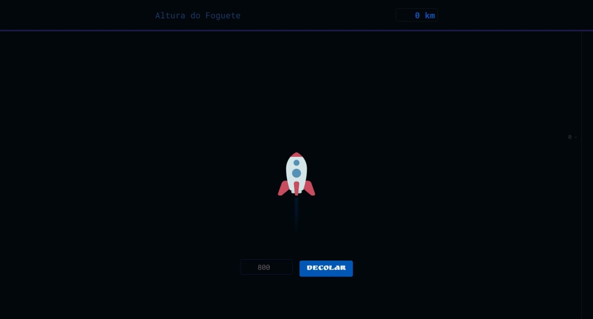

## Rocket Launch Simulation

Este é um projeto de simulação de lançamento de foguete, onde os usuários têm a oportunidade de estimar a altitude que um foguete atingirá em sua jornada pelo espaço. O projeto é composto por uma interface interativa em HTML, estilizada com CSS e controlada por JavaScript.

### Funcionalidades

- Os usuários podem estimar a altitude que o foguete alcançará, selecionando um número entre 600 e 4000 quilômetros.
- Após a estimativa, os usuários podem clicar no botão "Decolar" para iniciar a simulação do lançamento do foguete.
- Durante o lançamento, o foguete avança em direção ao espaço, e a barra lateral exibe os diferentes níveis de altitude.
- Ao atingir a altitude máxima, o projeto revela a altitude real alcançada pelo foguete e compara com a estimativa do usuário.
- O projeto fornece feedback sobre a precisão da estimativa do usuário.

### Tecnologias Utilizadas

- HTML5
- CSS3
- JavaScript
